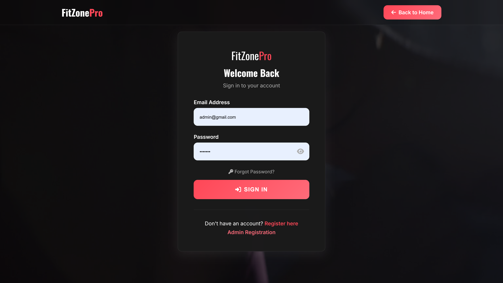
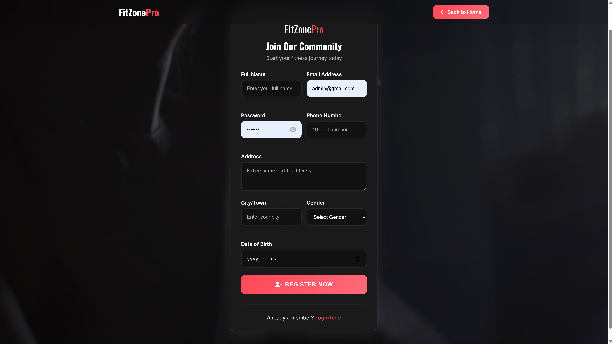
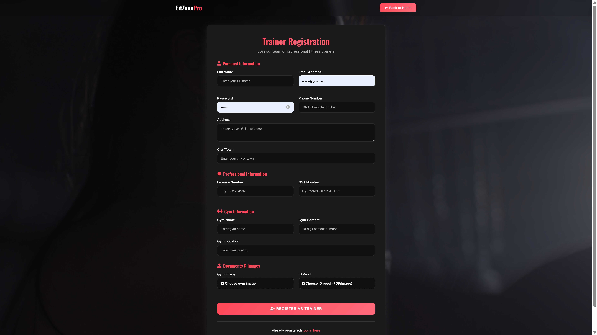
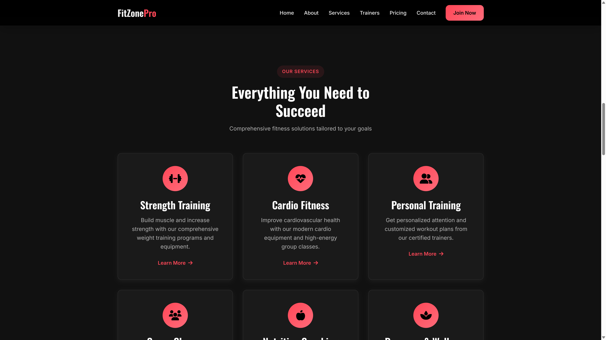
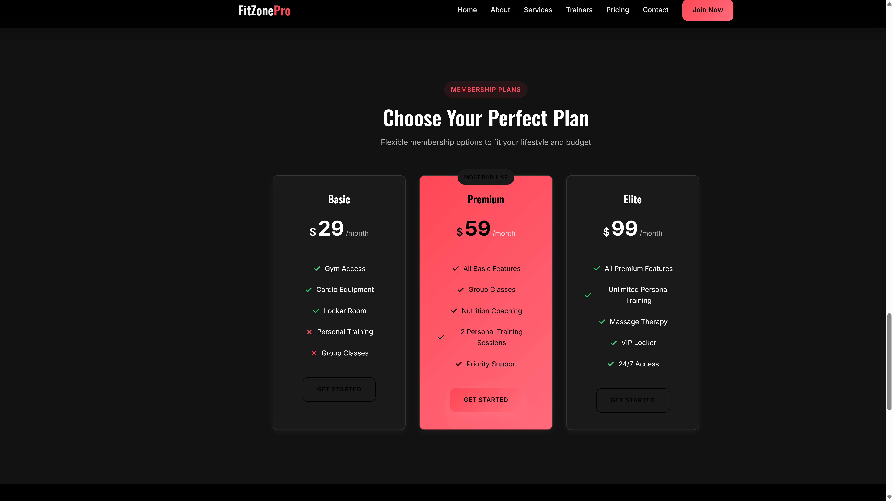
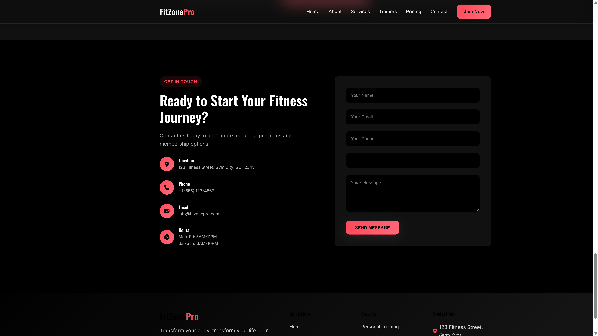

# 🏋️ GYM MANAGEMENT SYSTEM (DEMO VERSION)

<div align="center">


</div>

## ⚠️ IMPORTANT NOTICE

**THIS IS A DEMONSTRATION VERSION WITH LIMITED FUNCTIONALITY**

Core backend features including payment processing, email notifications, and advanced admin controls have been intentionally removed. This version is for **evaluation and portfolio purposes only**.

### 📧 Contact for Full Project

**Developer:** Vivek P S  
**Email:** viveksubhash4@gmail.com  
**GitHub:** [@VivekOrginal](https://github.com/VivekOrginal)

💼 **Interested in the complete working project?** Contact me to purchase the full version with all features fully implemented and production-ready.

---

## 📋 Table of Contents

- [Overview](#overview)
- [Features](#features)
- [Technology Stack](#technology-stack)
- [System Architecture](#system-architecture)
- [Installation](#installation)
- [Configuration](#configuration)
- [Usage](#usage)
- [Database Schema](#database-schema)
- [Demo Limitations](#demo-limitations)
- [Full Version Features](#full-version-features)
- [Screenshots](#screenshots)
- [License](#license)
- [Contact](#contact)

---

## 🌟 Overview

The Gym Management System is a comprehensive PHP-based web application designed to streamline gym operations and enhance member experience. This platform combines member management, trainer coordination, payment processing, and administrative controls to create a complete fitness center ecosystem.

**⚠️ Note:** This demo version showcases the UI/UX and frontend functionality. Backend features like payment processing and email notifications are not functional in this version.

### Mission Statement
**"Empowering fitness centers with technology for efficient management and enhanced member experience"**

### Key Objectives
- Provide comprehensive member management capabilities
- Enable efficient trainer-member coordination
- Streamline payment and membership processes
- Offer detailed analytics and reporting
- Create a seamless user experience across all roles

---

## ✨ Features

**⚠️ DEMO VERSION NOTICE:** The features listed below represent the full project design. In this demo version, only frontend UI/UX is functional. Backend operations (payments, emails) are not implemented.

### 🔐 User Authentication & Management
- **Multi-Role System** - Members, Trainers, and Administrators *(UI only in demo)*
- **Secure Registration** - Email verification and validation *(Not functional in demo)*
- **Password Management** - Reset and change password functionality *(Frontend only)*
- **Profile Management** - Complete user profile customization *(Basic functionality)*
- **Session Security** - Secure session handling and timeout *(Limited in demo)*
- **Role-Based Access** - Different permissions for each user type *(Frontend only)*

### 👥 Member Management System
- **Member Registration** - Complete registration with profile setup *(UI only)*
- **Membership Plans** - Multiple membership tiers and packages *(Static data)*
- **Booking System** - Book gym sessions and classes *(Frontend only)*
- **Payment Integration** - Secure payment processing for memberships *(Not functional in demo)*
- **Diet Plan Requests** - Request personalized diet plans from trainers *(UI only)*
- **Progress Tracking** - Monitor fitness progress and achievements *(Frontend only)*
- **Membership Status** - Real-time membership status and expiry tracking *(Static data)*
- **Payment History** - Complete transaction history and receipts *(Not functional in demo)*

### 🏃♂️ Trainer Management System
- **Trainer Registration** - Professional trainer onboarding *(UI only)*
- **Profile Verification** - Admin approval system for trainers *(Frontend only)*
- **Diet Plan Creation** - Create and manage personalized diet plans *(UI only)*
- **Member Assignment** - Assign and manage members *(Frontend only)*
- **Progress Monitoring** - Track member progress and performance *(Not functional in demo)*
- **Schedule Management** - Manage training schedules and availability *(Frontend only)*
- **Revenue Tracking** - Monitor earnings from diet plans and sessions *(Not functional in demo)*
- **Communication Tools** - Direct communication with assigned members *(Not functional in demo)*

### 🛠️ Admin Panel & Controls
- **Complete Dashboard** - Comprehensive overview of gym operations *(UI only)*
- **Member Analytics** - Detailed member statistics and insights *(Static data)*
- **Trainer Management** - Approve, manage, and monitor trainers *(Frontend only)*
- **Category Management** - Create and manage workout categories *(Basic functionality)*
- **Plan Management** - Configure membership and diet plans *(UI only)*
- **Payment Oversight** - Monitor all financial transactions *(Not functional in demo)*
- **Report Generation** - Generate detailed reports and analytics *(Not functional in demo)*
- **System Configuration** - Configure system settings and preferences *(Frontend only)*

### 💰 Payment & Financial System
- **Secure Payment Processing** - Multiple payment gateway support *(Not functional in demo)*
- **Membership Fee Management** - Automated membership billing *(Not functional in demo)*
- **Diet Plan Payments** - Separate billing for diet consultations *(Not functional in demo)*
- **Payment Status Tracking** - Real-time payment status updates *(Frontend only)*
- **Invoice Generation** - Automatic invoice creation and delivery *(Not functional in demo)*
- **Revenue Analytics** - Detailed financial reporting and insights *(Not functional in demo)*
- **Refund Management** - Handle refunds and payment disputes *(Not functional in demo)*
- **Payment Reminders** - Automated payment reminder system *(Not functional in demo)*

### 📱 Modern UI/UX Design
- **Responsive Design** - Optimized for all devices and screen sizes *(Fully functional)*
- **Modern Interface** - Clean, professional, and user-friendly design *(Fully functional)*
- **Dark Theme Support** - Modern dark theme with gradient accents *(Fully functional)*
- **Mobile-First** - Optimized for mobile devices and tablets *(Fully functional)*
- **Fast Loading** - Optimized performance and quick page loads *(Fully functional)*
- **Accessibility** - WCAG compliant and accessible design *(Fully functional)*

---

## 🛠️ Technology Stack

### Backend Technologies
```
- PHP 7.4+ (Server-side scripting)
- MySQL 5.7+ (Database management)
- Apache/Nginx (Web server)
- PHPMailer 6.10+ (Email functionality)
- Composer (Dependency management)
```

### Frontend Technologies
```
- HTML5 (Semantic markup)
- CSS3 (Modern styling)
- JavaScript ES6+ (Interactive functionality)
- Bootstrap 4.5+ (Responsive framework)
- jQuery 3.6+ (DOM manipulation)
- Font Awesome 5.15+ (Icons)
```

### Development Tools
```
- Git (Version control)
- Composer (Package manager)
- XAMPP/WAMP (Development environment)
- phpMyAdmin (Database management)
- Visual Studio Code (Recommended IDE)
```

---

## 🏗️ System Architecture

### Project Structure
```
gym/
├── assets/                     # Static assets
│   ├── css/                   # Stylesheets
│   ├── js/                    # JavaScript files
│   ├── img/                   # Images and graphics
│   └── fonts/                 # Font files
├── uploads/                   # User uploads (demo files)
├── PHPMailer/                # Email functionality
├── vendor/                   # Composer dependencies
├── Doc/                      # Documentation files
├── screenshots/              # Application screenshots
├── *.php                     # Core PHP application files
├── *.html                    # Static HTML pages
├── composer.json             # Composer configuration
└── README.md                 # This file
```

---

## 📦 Installation

### Prerequisites

**Required Software:**
- PHP 7.4 or higher ([Download](https://www.php.net/downloads))
- MySQL 5.7 or higher ([Download](https://dev.mysql.com/downloads/))
- Apache Web Server (XAMPP recommended)
- Modern web browser

### Step-by-Step Installation

#### 1. Clone the Repository
```bash
git clone https://github.com/VivekOrginal/GYM-MANAGEMENT-PHP.git
cd GYM-MANAGEMENT-PHP
```

#### 2. Setup Web Server
```bash
# Copy project to web server directory
# For XAMPP: C:\xampp\htdocs\gym\
# For WAMP: C:\wamp64\www\gym\
```

#### 3. Install Dependencies
```bash
composer install
```

#### 4. Access Application
- **Main Site:** http://localhost/gym/
- **Demo Pages:** Navigate through the interface

### Quick Setup (Windows with XAMPP)
1. Download and install XAMPP
2. Clone repository to `C:\xampp\htdocs\gym\`
3. Start Apache from XAMPP Control Panel
4. Access http://localhost/gym/

---

## 🚀 Usage

### Demo Usage

1. Open `index.html` or `modern.html` in your browser
2. Navigate through the demo features
3. All backend links will show demo limitations
4. Frontend functionality is fully operational

### Available in Demo
- ✅ Complete UI/UX design
- ✅ Responsive layouts
- ✅ Interactive forms
- ✅ Navigation systems
- ✅ Visual components
- ✅ Static content display

---

## 🗄️ Database Schema

### Users Table (Demo Structure)
```sql
CREATE TABLE users (
    id INT PRIMARY KEY AUTO_INCREMENT,
    username VARCHAR(50) UNIQUE NOT NULL,
    email VARCHAR(100) UNIQUE NOT NULL,
    password VARCHAR(255) NOT NULL,
    full_name VARCHAR(100) NOT NULL,
    phone VARCHAR(15),
    role ENUM('admin', 'member', 'trainer') DEFAULT 'member',
    created_at TIMESTAMP DEFAULT CURRENT_TIMESTAMP
);
```

### Additional Tables (Full Version Only)
- Memberships Table
- Trainers Table  
- Diet Plans Table
- Payments Table
- Categories Table
- Analytics Tables

---

## ⚠️ Demo Limitations

### Removed Features (Demo Version)

❌ **Backend Features:**
- Payment processing system
- Email notification system
- Database operations for transactions
- SMS integration
- Advanced authentication
- Real-time data processing
- File upload functionality
- Report generation

❌ **Security Features:**
- Production-grade encryption
- Advanced session management
- Rate limiting
- CSRF protection implementation

❌ **Integration Features:**
- Payment gateway APIs
- Email service providers
- Third-party integrations
- Cloud storage

### Available Features (Demo Version)

✅ **Frontend Features:**
- Complete UI/UX design
- Responsive layouts
- Interactive components
- Navigation systems
- Form interfaces
- Visual elements

✅ **Basic Backend:**
- Static content serving
- Basic routing
- Template rendering
- Asset management

---

## 🎯 Full Version Features

### Complete Backend Implementation
- ✅ Fully functional payment processing
- ✅ Complete email notification system
- ✅ Advanced user authentication
- ✅ Real-time database operations
- ✅ File upload and management
- ✅ Automated report generation
- ✅ SMS integration system

### Production-Ready Features
- ✅ MySQL database with full schema
- ✅ Secure payment gateways
- ✅ Email service integration
- ✅ Cloud storage support
- ✅ Advanced security measures
- ✅ Performance optimization
- ✅ Scalability features

### Additional Features
- ✅ Multi-language support
- ✅ Advanced analytics
- ✅ Mobile app integration
- ✅ API endpoints
- ✅ Third-party integrations
- ✅ Custom reporting
- ✅ Backup systems

### Documentation & Support
- ✅ Complete API documentation
- ✅ Installation guides
- ✅ User manuals
- ✅ Video tutorials
- ✅ Technical support
- ✅ Future updates

---

## 📸 Screenshots

<div align="center">

### Homepage


### User Authentication
<table>
  <tr>
    <td></td>
    <td></td>
  </tr>
</table>

### Trainer Registration


### Additional Views
<table>
  <tr>
    <td></td>
    <td></td>
  </tr>
  <tr>
    <td></td>
    <td></td>
  </tr>
</table>

---

## 📄 License

**Proprietary License**

© 2025 Vivek P S. All Rights Reserved.

This is a demonstration version with restricted usage:

❌ No commercial use
❌ No redistribution
❌ No modification
✅ Evaluation purposes only

---

## 📞 Contact

### Developer Information

**Vivek P S**

📧 **Email:** viveksubhash4@gmail.com  
🐙 **GitHub:** [@VivekOrginal](https://github.com/VivekOrginal)  
💼 **LinkedIn:** [Connect with me](https://linkedin.com/in/vivekps)

### Purchase Full Version

**What You Get:**
✅ Complete source code with all features
✅ Full backend implementation
✅ Production-ready deployment
✅ Database schema and setup
✅ Documentation & guides
✅ Technical support
✅ Future updates
✅ Customization options

**Payment Methods:**

<div align="center">


*Scan to pay via Google Pay/UPI*

</div>

**Contact:** viveksubhash4@gmail.com

---

## 🙏 Acknowledgments

PHP Community for excellent documentation
Bootstrap team for responsive framework
PHPMailer contributors for email functionality
Open source community for inspiration

---

## 📊 Project Statistics

**Lines of Code:** 12,000+ (Full Version)
**Files:** 85+ (Full Version)
**Database Tables:** 15+ (Full Version)
**Features:** 50+ (Full Version)
**Demo Files:** 25+
**Screenshots:** 9

---

<div align="center">

**Made with ❤️ for fitness enthusiasts and gym management**

*This demo is provided to showcase the frontend design and user interface. The complete functionality is available in the full version.*

© 2025 Vivek P S. All Rights Reserved.

[⬆ Back to Top](#-gym-management-system-demo-version)

</div>
